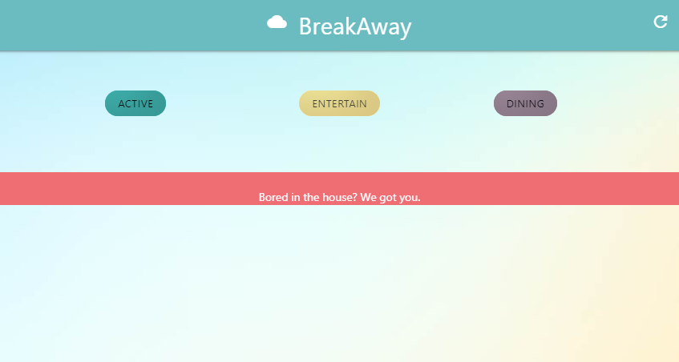

# BreakAway

## Purpose:
The purpose of this application is to allow the users to find things to do nearby them in an effort to increase mental and physical health based on the following items:
<ul>
<li>Engaging Activity
<li>Food or Drink
<li>Entertainment
</ul>

Once the user has made their choice they are then presented with options nearby them based on either a searched city or zip code

## Languages Used:
JQuery, JavaScript, HTML, Materialize CSS, Google API and TicketMaster API

### Psuedo Example:

#### Example Images:

#### Deployed Site:
<a href="https://grimmedev.github.io/BreakAway/">BreakAway</a>

##### License
The MIT License
Copyright (c) 2020 Robert Grimes, Devin McComb, Halle Wehmeyer, Mary-Kathryn Holt

Permission is hereby granted, free of charge, to any person obtaining a copy of this software and associated documentation files (the "Software"), to deal in the Software without restriction, including without limitation the rights to use, copy, modify, merge, publish, distribute, sublicense, and/or sell copies of the Software, and to permit persons to whom the Software is furnished to do so, subject to the following conditions:

The above copyright notice and this permission notice shall be included in all copies or substantial portions of the Software.

THE SOFTWARE IS PROVIDED "AS IS", WITHOUT WARRANTY OF ANY KIND, EXPRESS OR IMPLIED, INCLUDING BUT NOT LIMITED TO THE WARRANTIES OF MERCHANTABILITY, FITNESS FOR A PARTICULAR PURPOSE AND NONINFRINGEMENT. IN NO EVENT SHALL THE AUTHORS OR COPYRIGHT HOLDERS BE LIABLE FOR ANY CLAIM, DAMAGES OR OTHER LIABILITY, WHETHER IN AN ACTION OF CONTRACT, TORT OR OTHERWISE, ARISING FROM, OUT OF OR IN CONNECTION WITH THE SOFTWARE OR THE USE OR OTHER DEALINGS IN THE SOFTWARE.